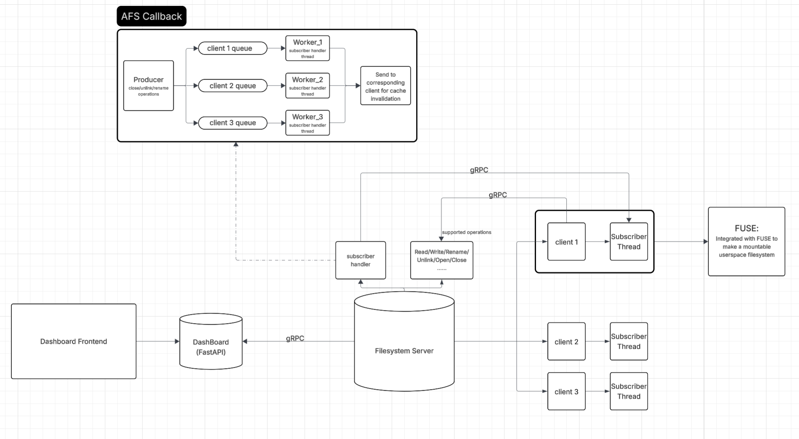
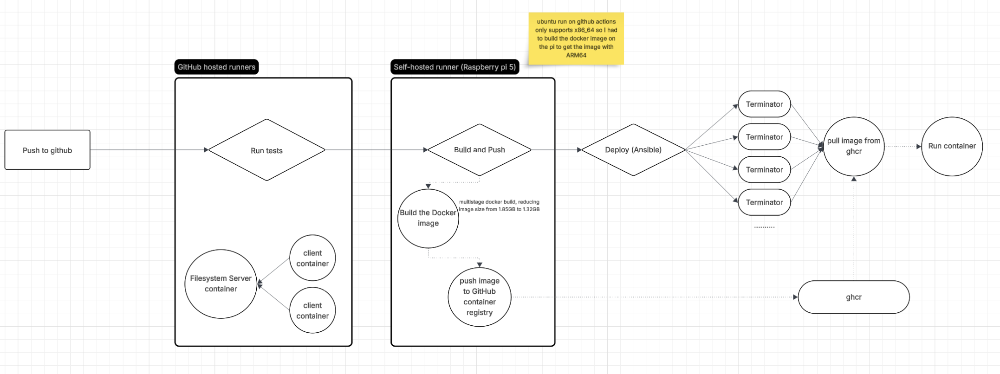

# Distributed Filesystem using gRPC and FUSE

This project implements a AFS like distributed filesystem that allows clients to access and manipulate files stored on a remote server as if they were local files. It leverages **FUSE (Filesystem in Userspace)** to mount the filesystem locally and **gRPC** for efficient network communication between the client and server.

##  Key Features

* **FUSE Integration:** Mounts the remote server directory onto the local client machine, allowing standard CLI tools (`ls`, `cat`, `echo`, `cp`) and editors (Vim, Nano) to work seamlessly.
* **Smart Caching:** Implements client-side whole file caching to reduce network latency. Files are cached locally upon access and validated against the server.
* **Strong Consistency:** Uses a subscription-based (register callback) model. When a file is modified, renamed, or deleted by one client, the server instantly notifies other subscribed clients to invalidate their local caches for that specific file.
* **Atomic Operations:** Supports atomic renames, enabling safe file saving for modern text editors.
* **Dockerized Deployment:** Includes a fully containerized environment with a server and multiple clients for easy testing on the same machine.
* **Dashboard:** A dashboard implemented with FastAPI which allows the maintainer to keep track of the server states.
##  Architecture

The system consists of three main components:

1.  **Server (`afs_server`)**:
    * The authoritative source of truth.
    * Manages file storage, metadata, and handles concurrent client requests.
    * Maintains a registry of connected clients to broadcast invalidation notifications. 
    * Each connected client has a worker producer queue on the server to more effectively handle large amounts of invalidations.

2.  **Client (`afs_client`)**:
    * Translates FUSE kernel requests into gRPC calls.
    * Maintains a local cache directory (`./tmp/cache`) to serve read requests quickly.
    * Runs a background thread to listen for server updates.

3.  **Communication**:
    * Data and metadata are serialized using **Protocol Buffers** and transmitted via **gRPC**.



## Prerequisites

* **C++ Compiler:** C++17 or higher (e.g., `g++`, `clang++`).
* **CMake:** Version 3.10+.
* **FUSE:** `libfuse-dev` (Linux) or `osxfuse` (macOS).
* **gRPC & Protobuf:** `libgrpc++-dev`, `libprotobuf-dev`, `protobuf-compiler-grpc`.
* **Boost:** Specifically `boost-system` and `boost-filesystem`.

## Build Instructions

You can build the project manually using CMake:

```bash
# 1. Create a build directory
mkdir build && cd build

# 2. Configure the project
cmake ..

# 3. Compile executables
make
```

## CICD Architecture

